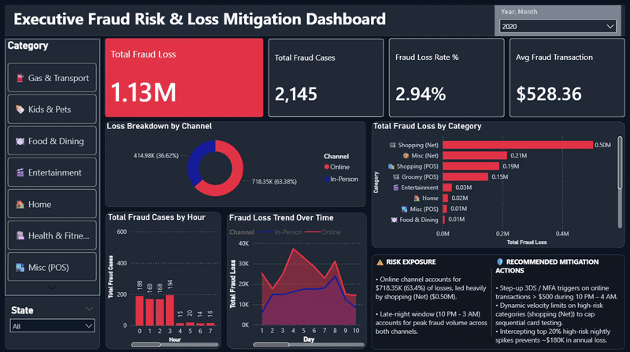
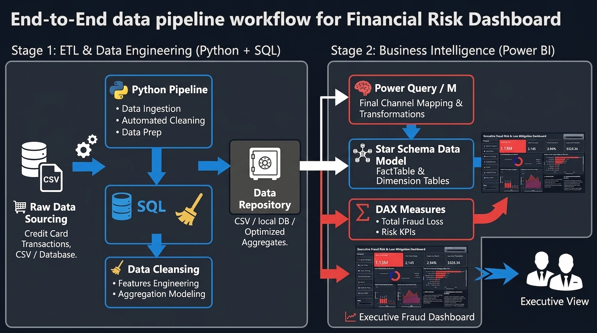

# 🛡️ Executive Fraud Risk & Loss Mitigation Dashboard


An end-to-end data analytics pipeline and interactive Power BI dashboard designed to identify high-risk financial transaction channels, quantify loss exposure, and formulate targeted mitigation strategies.

---

## 📑 Executive Assets

* 📄 **[View Executive Presentation Deck (PDF)](assets/Executive_Fraud_Mitigation_Deck.pdf)**
* 📊 **[Executive Dashboard Screenshot](assets/dashboard_preview.png)**
* 🔄 **[End-to-End Pipeline Workflow](assets/pipeline_workflow.png)**

---

## 📹 Interactive Dashboard Walkthrough



> *Note: If the video player does not load automatically in your web browser, you can inspect the full MP4 recording inside the [`assets/`](assets/) directory.*

---

## 📌 Business Overview

This project analyzes **$1.13M in financial transaction fraud** across online (`_net`) and physical (`_pos`) channels. By integrating raw transaction logs through SQL and Python into a Star Schema Power BI model, the executive dashboard exposes channel-specific vulnerabilities and provides actionable rules to prevent annual fraud losses.

### Key Takeaways:
* **Primary Exposure:** Online (`_net`) transactions account for **63.4% ($718.35K)** of overall fraud loss.
* **Peak Window:** Fraud volume surges heavily during late-night hours (**10:00 PM – 3:00 AM**).
* **Financial Impact:** Implementing target risk controls on top-tier overnight spikes projects **~$180K in annual loss prevention**.

---

## 🛠️ Tech Stack & Workflow

* **Data Extraction & Transformation:** `SQL` (Filtering, aggregate grouping, and cleaning logic)
* **Automated Data Pipeline:** `Python` (`pandas` / automated feature engineering & preprocessing)
* **Data Modeling & BI:** `Power BI` (Star Schema, DAX calculation table, custom dark-mode executive UX)

---

## 🔄 End-to-End Pipeline Architecture



---

## 📂 Repository Structure

```text
├── assets/
│   ├── dashboard_preview.png         # High-resolution dashboard screenshot
│   ├── dashboard_demo.mp4            # Interactive screen recording walkthrough
│   ├── pipeline_workflow.png         # E2E pipeline architectural diagram
│   └── Executive_Fraud_Mitigation_Deck.pdf  # 5-Slide presentation deck
├── python/
│   └── financial_risk.py              # Automated data cleaning & transformation script
├── sql/
│   └── financial_risk_sql_queries.sql             # Data manipulation and queries
├── power_bi/
│   └── financial_risk_analysis_dashboard.pbix # Interactive Power BI report file
└── README.md                         # Project documentation